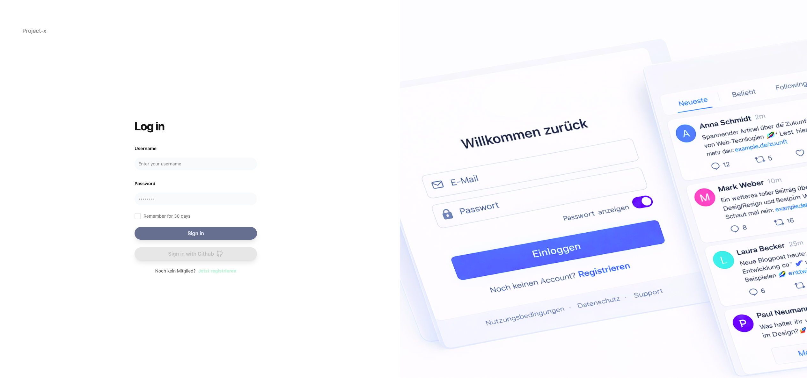
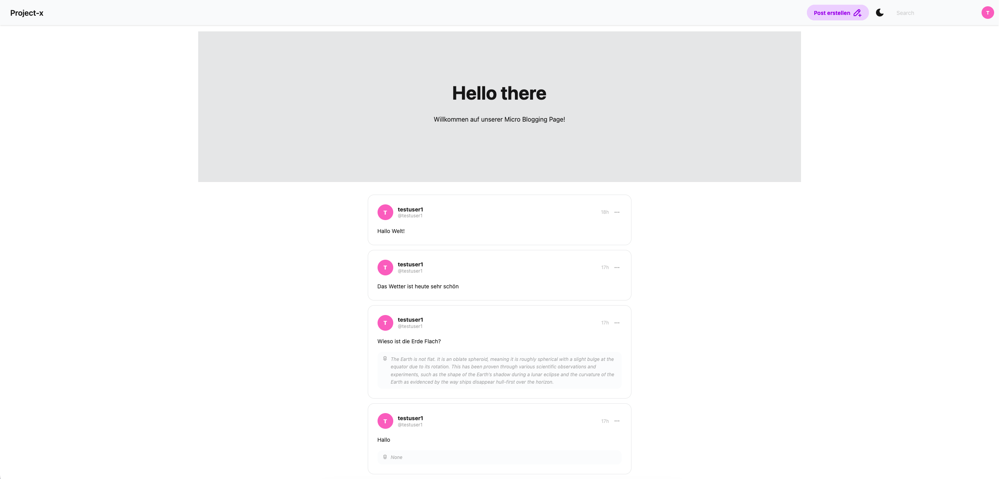
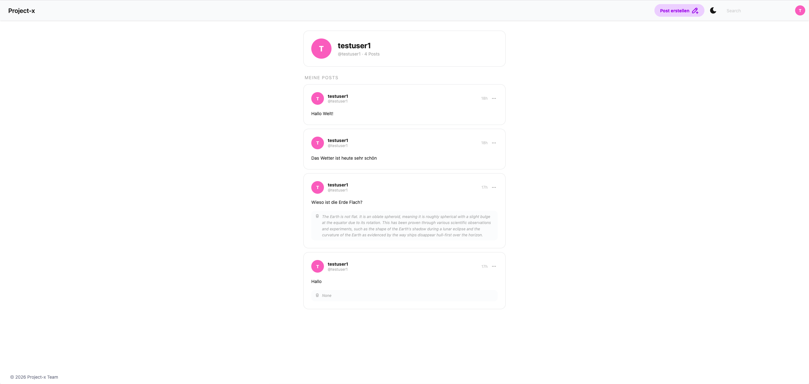

# Project-x
 
Im Rahmen einer Transferarbeit im Fach Software und Plattformarchitektur haben wir eine moderne Micro-Blogging Plattform inspiriert von Twitter gebaut mit Nuxt 4, Node.js/Express, PostgreSQL und KI-gestützter Inhaltsmoderation via Ollama. Das Projekt wurde praxisorientiert umgesetzt mit berücksichtigung der verschiedenen Architekturaspekte sowie mordernen Technologien
 
---
 
## Was ist Project-x?
 
Project-x ist eine Full-Stack Micro-Blogging Applikation wo Benutzer kurze Posts (Tweets) erstellen können. Die Plattform verfügt über eine integrierte KI-Inhaltsmoderation die Hassrede automatisch erkennt und entsprechende Posts entfernt.
 
### Features
 
- **Authentifizierung** — Registrierung & Login mit JWT Token
- **Posts erstellen** — Tweets mit max. 255 Zeichen
- **KI-Moderation** — Automatische Erkennung von Hassrede via Ollama
- **Profil** — Eigene Posts & Avatar (Initialen-basiert)
- **Dark/Light Mode** — Theme Toggle
- **Echtzeit-Updates** — Automatisches Polling alle 5 Sekunden
 
### Tech Stack
 
| Bereich | Technologie |
|---|---|
| Frontend | Nuxt 4, Vue 3, TypeScript, TailwindCSS, DaisyUI |
| Backend | Node.js, Express, TypeScript |
| Datenbank | PostgreSQL, Drizzle ORM |
| KI | Ollama (granite4:1b) |
| Message Broker | BullMQ, Redis |
| Logging | Pino |
| Monitoring | Grafana, Prometheus |
| Infrastruktur | Docker, Nginx |
 
---
 
## Installation & Setup
 
### Voraussetzungen
 
- [Docker](https://www.docker.com/) & Docker Compose
- [Bun](https://bun.sh/) (für lokale Entwicklung)
 
### Docker Setup (empfohlen)
 
**1. Repository klonen**
 
```bash
git clone https://github.com/ccaillet00/project-x.git
cd project-x
```
 
**2. Environment Variables konfigurieren**
 
```bash
cp .env.example .env
```
 
`.env` Datei anpassen:
 
```env
# JWT
JWT_SECRET=  'run command "openssl rand -base64 32" to generate a secret value'
 
# Redis
CACHE_ACTIVE= 'true or false'
 
# Log Level
LOG_LEVEL= 'info' or 'warn' or 'error'
```
 
**3. Docker Container starten**
 
```bash
docker compose up --build
```
 
**4. Applikation aufrufen**
 
| Service | URL |
|---|---|
| Frontend | http://localhost:4000 |
| Backend API | http://localhost/api |
 
---
 
## API Endpoints
 
### Authentifizierung
 
| Method | Endpoint | Beschreibung | Auth |
|---|---|---|---|
| `POST` | `/api/auth/register` | Neuen Benutzer registrieren | ❌ |
| `POST` | `/api/auth/login` | Einloggen, JWT erhalten | ❌ |
 
**Register Request:**
```json
{
  "username": "max",
  "email": "max@example.com",
  "password": "passwort123"
}
```
 
**Login Request:**
```json
{
  "username": "max",
  "password": "passwort123",
  "remember": 0
}
```
 
**Login Response:**
```json
{
  "message": "Login successful",
  "jwt": "eyJhbGciOiJIUzI1NiIsInR5cCI6IkpXVCJ9..."
}
```
 
---
 
### Posts
 
| Method | Endpoint | Beschreibung | Auth |
|---|---|---|---|
| `GET` | `/api/posts` | Alle Posts abrufen | ❌ |
| `POST` | `/api/posts` | Neuen Post erstellen | ✅ |
| `PUT` | `/api/posts/:id` | Post bearbeiten | ✅ |
| `DELETE` | `/api/posts/:id` | Post löschen | ✅ |
 
**Post erstellen Request:**
```json
{
  "tweet": "Hallo Welt!",
  "userId": 1
}
```
 
**Post Response:**
```json
{
  "id": 1,
  "tweet": "Hallo Welt!",
  "userId": 1,
  "username": "max",
  "created": "2026-03-17T10:00:00.000Z",
  "sentiment": "",
  "correction": "",
}
```

---
 
## Screenshots
 
### Login & Registrierung

 
### Feed / Hero Page

 
### Post Modal

 
### Profil

 
---
 
## Architektur
 

 
### KI-Moderation Flow
 
```
Post erstellen
  └── In DB speichern
  └── Job an BullMQ Queue
        └── Worker analysiert mit Ollama
              ├── ok        → sentiment in DB updaten
              └── dangerous → Post automatisch löschen
```
 
---
 
## Docker Services
 
| Service | Beschreibung | Port |
|---|---|---|
| `webserver` | Nginx Loadbalancer | 80 |
| `frontend-demo-api` | Nuxt Frontend | 4000 |
| `api` | Express Backend (2 Replicas) | 3000 |
| `worker` | BullMQ Worker | — |
| `database` | PostgreSQL | 5432 |
| `redis` | Redis Stack | 6379 |
| `ollama` | Ollama KI | 12434 |
 
---
## Performance Test

[Performance_Test](/docs/Performance.md) 

---
## Team
 
Project-x — entwickelt im Rahmen des Moduls Software- und Plattformarchitektur.
 
---
 
*Letzte Aktualisierung: März 2026*